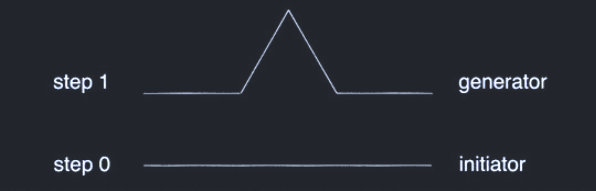

## What is a Koch curve?

  A Koch curve (alternatively Koch snowflake) is a curve that contains multiple layers of folds inside of even more folds. It resembles patterns often seen in nature such as, coastlines and snowflakes. The result is an aesthetic complex shape that pairs nicely with computer graphics.

 A Koch curve is a part of the field in mathematics known as 'fractal geometry'. The field was popularised by mathematician Benoit Mandelbrot (commonly referred to as the father of fractal geometry). Although Mandelbrot is quite famous for his discoveries, earlier mathematicians had found similar mathematical properties, but they found them to be quite strange and difficult to reason about. This gave rise the field being labelled as "mathematical monsters" by early mathematicians (Gaddis and Zyda). 

Fractal geometry is broad field. There exists many types of fractals, some well-known ones being, the Sierpinski triangle, the Cantor set, and the famous, Mandelbrot set.  

## Requirements:

- [GCC](https://gcc.gnu.org/releases.html) or [Clang](https://clang.llvm.org/get_started.html) (C compiler) 
- [raylib](https://github.com/raysan5/raylib)
- basic knowledge of C

We will be using [raylib](https://github.com/raysan5/raylib) a C based graphics library.

## Getting Started
Once raylib is installed create a directory called `fractal`. Insert a file `main.c` into the project's root directory. 

If you are using a Unix-like operating system this can be done by doing: 
```
mkdir fractal
cd fractal
touch main.c
```
To speed up our work we will borrow some boilerplate from raylib's [example page.](https://www.raylib.com/examples.html)
```
/*******************************************************************************************
*
*   raylib [core] example - Basic window
*
*   Example licensed under an unmodified zlib/libpng license, which is an OSI-certified,
*   BSD-like license that allows static linking with closed source software
*
*   Copyright (c) 2013-2024 Ramon Santamaria (@raysan5)
*
********************************************************************************************/

#include "raylib.h"

// Program main entry point
//------------------------------------------------------------------------------------
int main(void)
{
    // Initialization
    const int screenWidth = 800;
    const int screenHeight = 450;

    InitWindow(screenWidth, screenHeight, "raylib [core] example - basic window");

    SetTargetFPS(60);               // Set our game to run at 60 frames-per-second

    // Main game loop
    while (!WindowShouldClose())    // Detect window close button or ESC key
    {
        // Update
        //----------------------------------------------------------------------------------
    
        // Draw
       BeginDrawing();

            ClearBackground(RAYWHITE);

            DrawText("Congrats! You created your first window!", 190, 200, 20, LIGHTGRAY);

        EndDrawing();
        //----------------------------------------------------------------------------------
    }

    // De-Initialization
    CloseWindow();        // Close window and OpenGL context
    
return 0;
}
```
After running the program you should see this output: 


If you managed to get the above image, congratulations you ran your first raylib program, but our work is not done. Next, we will use our boilerplate code to generate the Koch curve.

## Koch curve 

We will be utilizing math functions, so it is necessary to include a `<math.h>`
header file at the top of the file. Additionally we will need the irrational number PI as shown below. Add the following lines to the top of the file right below `#include "raylib.h"`

```
#include <math.h>

#define pi M_PI
```

Next, define a global struct `point` that holds x and y coordinates.
```
typedef struct {
  double x, y;
} point
```

Now we will define the `kochCurve()` function which will be called recursively. The return type will be `void`. The function will take in 3 arguments: a `point p1`, a `point p2`, and an `int folds`. Points `p1` and `p2` are used to draw the "initiator", a straight the line, `folds` is used to determine the number of times the recursion is called. The function will look like this:

`void kochCurve(point p1, point p2, int folds)`

Inside our function `kochCurve()` declare three points as local variables `p3`, `p4`, and `p5`. These points will represent our "generator". Also define a `double theta` to be PI divided by 3. An explanation of the generator will be given later.
```
point p3, p4, p5;
double theta = pi / 3;
```

As previously mentioned an initiator is a straight line. More important is the generator, which is the result of taking the initiator dividing it into three equal parts and inserting into into it an equilateral triangle without a base. As shown below:




For the main bulk of the `Kochcurve` function begin by writing a conditional that will return true `if (fold > 0)`. With this our recursion will be able to terminate when this condition is false. Inside the conditional we will set points `p3`, `p4` and `p5` these points will calculate the generator, our equilateral triangle with the base removed. Then, we call the recursion `Kochcurve` four times making sure to subtract 1 from folds in each call. Finally if our condtion is false use raylib's `DrawLine()` function to all the lines. Include `BLACK` as the last argument available through raylib. Our final koch curve. Your function should look like this:

```  
void kochCurve(point p1, point p2, int folds) {
  point p3, p4, p5;
  double theta = pi / 3;

if (folds > 0) {
    p3 = (point){(2 * p1.x + p2.x) / 3, (2 * p1.y + p2.y) / 3};
    p5 = (point){(2 * p2.x + p1.x) / 3, (2 * p2.y + p1.y) / 3};

    p4 =
        (point){p3.x + (p5.x - p3.x) * cos(theta) + (p5.y - p3.y) * sin(theta),
                p3.y - (p5.x - p3.x) * sin(theta) + (p5.y - p3.y) * cos(theta)};

    kochCurve(p1, p3, folds - 1);
    kochCurve(p3, p4, folds - 1);
    kochCurve(p4, p5, folds - 1);
    kochCurve(p5, p2, folds - 1);
  }

  else {
    DrawLine(p1.x, p1.y, p2.x, p2.y, BLACK);
  }
}
```

All that is left is our main function.

Declare `p1`, `p2`, and `folds` below the variables `screenWidth and screenHeight`. The loop `while (!WindowShouldClose())` is our main loop. Inside it define `p1 = (point){0, screenHeight - 0}` and `p2 = (point){screenWidth - 0, screenHeight - 0}`. Replace the `DrawText("Congrats! You created your first window!", 190, 200, 20, LIGHTGRAY);` with `Kochcurve(p1, p2, folds)`. Here is our main function. 
```
int main() {
  const int screenWidth = 800;
  const int screenHeight = 450;

  // Kosch Initialization
  point p1, p2;
  int folds;

  // Screen Initialization
  InitWindow(screenWidth, screenHeight, "raylib [core] example - basic window");
  SetTargetFPS(1); // Set our game to run at 60 frames-per-second

  // Main game loop
  while (!WindowShouldClose()) // Detect window close button or ESC key
  {
    if (IsKeyPressed(KEY_S)) {
      TakeScreenshot("screenshot.png");
      // Be sure to not place this function inside a loop where
      // it saves a screenshot every frame!
    }
    p1 = (point){0, screenHeight - 0};
    p2 = (point){screenWidth - 0, screenHeight - 0};
    if(folds < 10){ 
      folds = folds + 1;
    }
    
    // Update
    BeginDrawing();
    ClearBackground(RAYWHITE);
    kochCurve(p1, p2, folds);
    EndDrawing();
  }

  // De-Initialization
  CloseWindow(); // Close window and OpenGL context
  return 0;
}
```

## Final Code
```
#include "raylib.h"
#include <math.h>

#define pi M_PI

typedef struct {
  double x, y;
} point;

void kochCurve(point p1, point p2, int folds) {
  point p3, p4, p5;
  double theta = pi / 3;

  if (folds > 0) {
    p3 = (point){(2 * p1.x + p2.x) / 3, (2 * p1.y + p2.y) / 3};
    p5 = (point){(2 * p2.x + p1.x) / 3, (2 * p2.y + p1.y) / 3};

    p4 =
        (point){p3.x + (p5.x - p3.x) * cos(theta) + (p5.y - p3.y) * sin(theta),
                p3.y - (p5.x - p3.x) * sin(theta) + (p5.y - p3.y) * cos(theta)};

    kochCurve(p1, p3, folds - 1);
    kochCurve(p3, p4, folds - 1);
    kochCurve(p4, p5, folds - 1);
    kochCurve(p5, p2, folds - 1);
  }

  else {
    DrawLine(p1.x, p1.y, p2.x, p2.y, BLACK);
  }
}

int main() {
  const int screenWidth = 800;
  const int screenHeight = 450;

  // Kosch Initialization
  point p1, p2;
  int folds;

  // Screen Initialization
  InitWindow(screenWidth, screenHeight, "raylib [core] example - basic window");
  SetTargetFPS(1); // Set our game to run at 60 frames-per-second

  // Main game loop
  while (!WindowShouldClose()) // Detect window close button or ESC key
  {
    if (IsKeyPressed(KEY_S)) {
      TakeScreenshot("kochcurve.png");
      // Be sure to not place this function inside a loop where
      // it saves a screenshot every frame!
    }
    p1 = (point){0, screenHeight - 0};
    p2 = (point){screenWidth - 0, screenHeight - 0};
    if(folds < 10){ 
      folds = folds + 1;
    }
    
    // Update
    BeginDrawing();
    ClearBackground(RAYWHITE);
    kochCurve(p1, p2, folds);
    EndDrawing();
  }

  // De-Initialization
  CloseWindow(); // Close window and OpenGL context
  return 0;
}
```
## Result 
To take a screenshot press `S` on your keyboard, while the program is running. You should see kochcurve.png in your project's root directory.

The final result:


Voila! You have now created a Koch Curve in C using raylib. Feel Free to mess around with the code and see what you can come up with.

Full code available [here](https://github.com)

## References 

Peitgen, Heinz-Otto, et al. Chaos and fractals: new frontiers of science. Vol. 106. New York: Springer, 2004.

Gaddis, Michael E., and Michael J. Zyda. The Fractal Geometry of Nature: Its Mathematical Basis and Application to Computer Graphics. Naval Postgraduate School, 1986.

“Koch Curve.” Rosetta Code, 15 Apr. 2024, https://rosettacode.org/wiki/Koch_curve.

Fractal Geometry. https://users.math.yale.edu/public_html/People/frame/Fractals/. 

### Feel free to reach out to me on: 
[X / Twitter](https://x.com/obwayadev)    
[LinkedIn](https://www.linkedin.com/in/matthewobwaya/)


